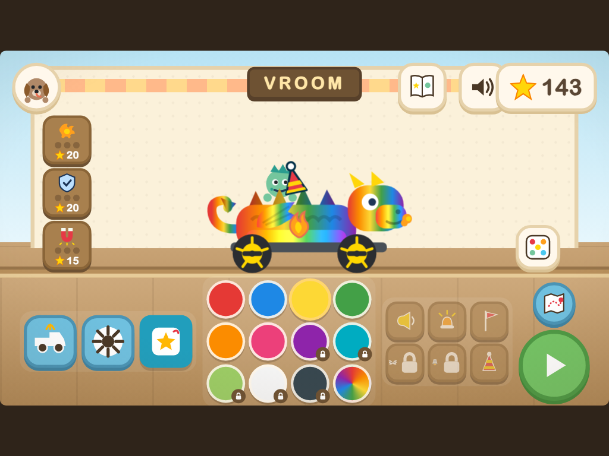
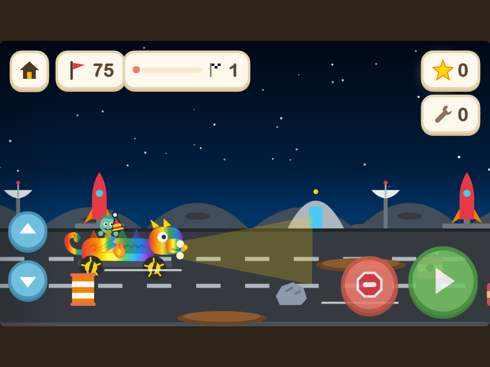
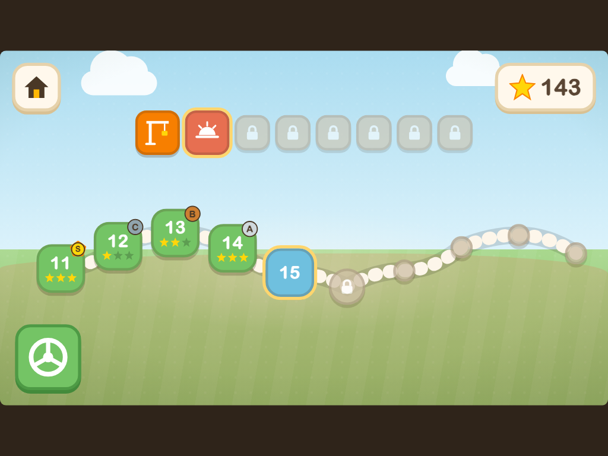
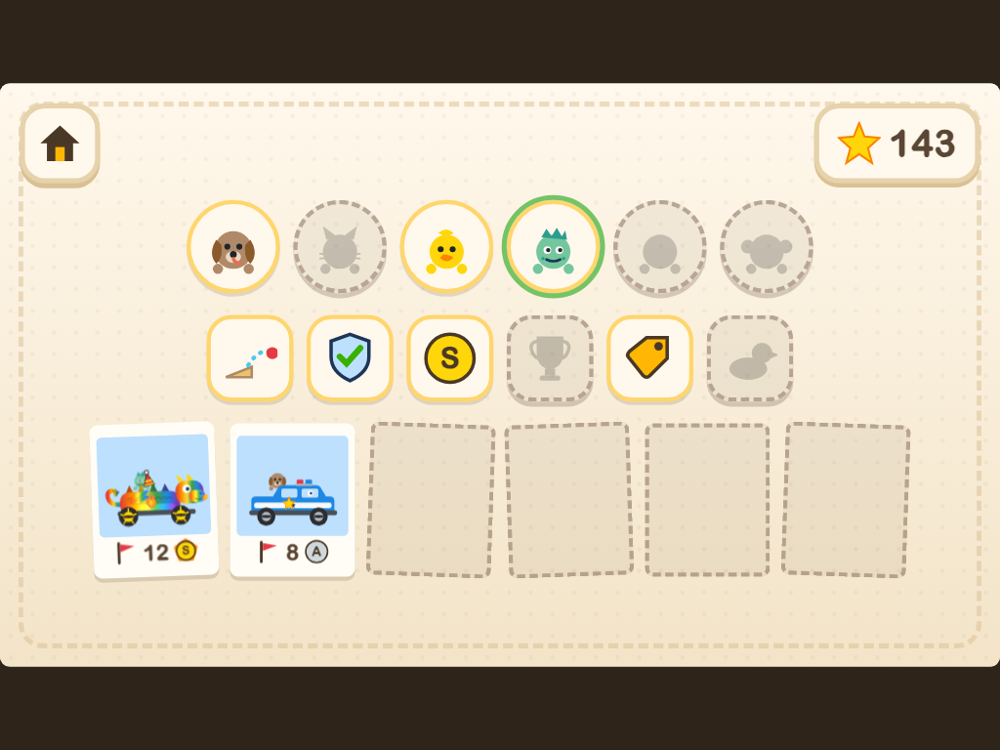
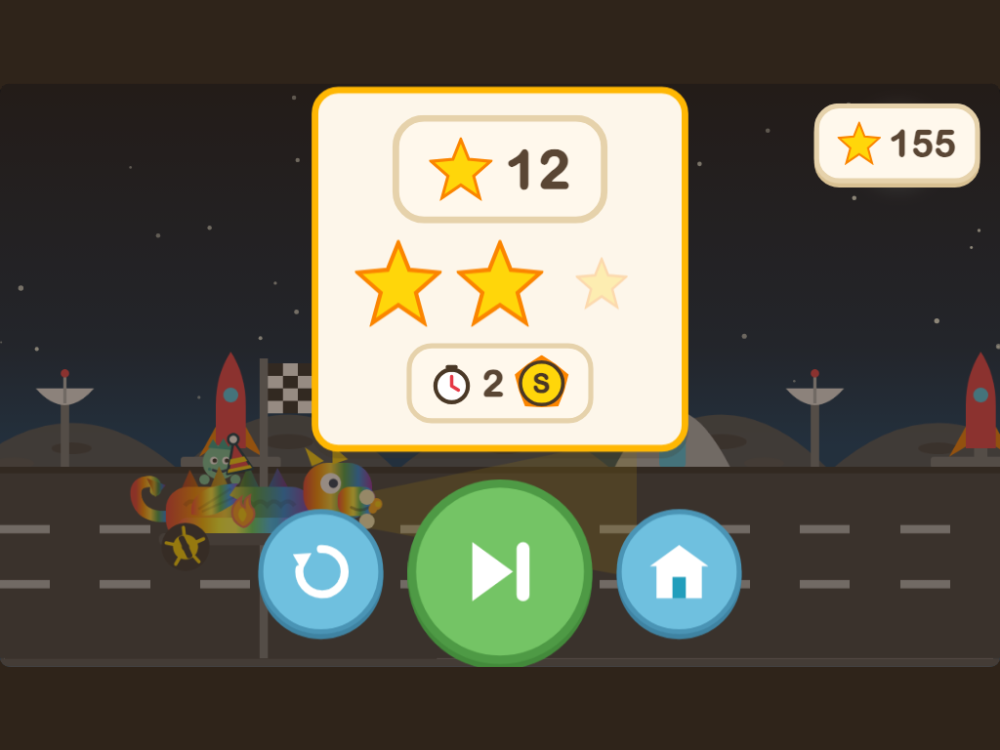

# Vroom

A build-a-car driving game for a 3 to 5 year old. One HTML file, zero dependencies,
works offline, made for an iPad in a car seat.

**Play it: https://zacker3310.github.io/vroom/**

## The rules it was built on

- Zero required reading. Icons, pictures, and numerals only.
- Nothing to lose. No fail states, no game-overs. Stars only go up, crashes are comedy.
- Every tap answers instantly with motion and sound. Every sound is synthesized in code.
- Every touch target is at least 64px on an iPad in landscape. Portrait politely asks you to rotate.

## What's inside

**The garage.** Build your ride from 15 bodies (dump truck to dragon to royal carriage),
8 wheel sets, 12 paints including rainbow, flank decals, and toggle extras like wings and
a rocket booster. Locked parts show in full color with a price tag: collect stars, tap, own it.
Upgrade the engine, shield, and star magnet at the workbench. Fix crash damage with the
wrench. Wash off real mud with your finger in the wash bay. A magic dice button builds
you a surprise.

**The road.** Three lanes, a gas pedal, a brake pedal. Swipe or use the arrows to steer
into stars and away from barrels, rocks, TNT, tumbleweeds, and crabs. Ramps jump, puddles
splash, capsules pop open with prizes, and the finish flag brings confetti, a star tally,
a 1 to 3 star rating, and an S/A/B/C time medal.

**Eight worlds, eighty levels.** Construction, sunset, night, rain, snow, desert, beach,
and space, each with its own scenery, weather, and hazards. Space has low gravity.
The map is a winding road of level nodes; beating a world's last level unlocks the next
and pays a trophy bonus. A free drive mode tours all eight worlds forever with no finish
line and no timer.

**The album.** Six buddy critters hide inside capsules and ride in the cab when found.
Sticker badges mark firsts (first jump, first clean run, first S medal...). Every finish
saves a polaroid of that exact build. All of it lives in a scrapbook.

## Controls

| | Touch (the real way) | Keyboard (desktop) |
|---|---|---|
| Drive | hold the green pedal, or anywhere on the road | D, right arrow, or space |
| Brake | red pedal | A or left arrow |
| Steer | swipe up/down, or the side arrows | W/S or up/down arrows |
| Honk | tap your car | |

## For the grown-ups

- **Profiles**: the avatar button (top left of the garage) holds up to three kids,
  each with their own save. No typing, just faces.
- **Save codes**: the same panel shows a QR of the save and copy/paste buttons for a
  full save code, so progress can move between devices. Opening
  `https://zacker3310.github.io/vroom/#save=<code>` imports one directly.
- **Quiet mode**: the speaker button drops every sound to car-friendly volume. It sticks.
- **Offline**: add it to the home screen from Safari and it runs with no connection.
- Progress lives in the browser's local storage on the device. Clearing Safari website
  data erases it, so export a save code first if it matters.

## Under the hood

- One `index.html`. No frameworks, no build step, no assets, no network calls.
  All art is inline SVG, all audio is Web Audio synthesis through a master compressor,
  all 80 levels come from a seeded generator so they are stable across plays.
- The QR code is produced by a hand-rolled encoder (byte mode, ECC level L, versions
  1 to 5, Reed-Solomon over GF(256)) verified byte-exact against a real decoder.
- `tests/` holds ten Playwright suites with 148 checks covering the economy, physics,
  worlds, album, profiles, save codes, and the wash. See `tests/README.md` to run them.
- Built with Claude Code in an agentic build loop: design and content generated by
  parallel subagents, every round audited by an adversarial reviewer with fix authority
  before merge. The full audit trail is in `.buildloop/review-report.md`.

Made for one particular kid. If it keeps yours busy on a road trip too, it did its job.
