<p align="center">
  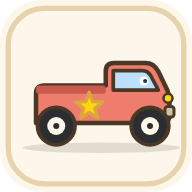
</p>

<h1 align="center">Vroom</h1>

<p align="center">
  A build-a-car driving game for a 3 to 5 year old. One HTML file, zero dependencies, works offline, made for an iPad in a car seat.
</p>

<p align="center">
  <a href="https://zacker3310.github.io/vroom/"><strong>Play it: zacker3310.github.io/vroom</strong></a>
</p>

<p align="center">
  <a href="https://github.com/zacker3310/vroom/actions/workflows/test.yml"></a>
  
  
  
</p>

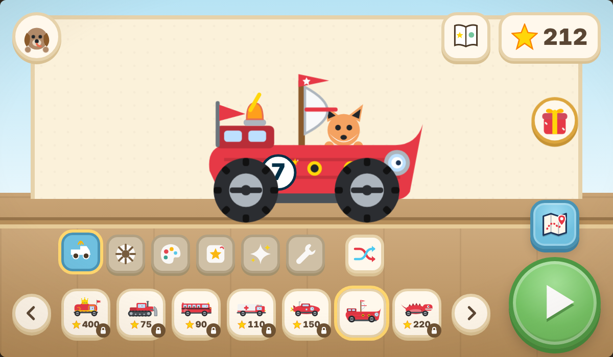

## Highlights

- **Build it, then drive it.** 23 bodies, 14 wheel sets, 24 paints (one of them a secret), 8 flank decals, 12 bolt-on extras, a race number you type on a keypad, and 10 buddies, every one of them drawn in code. The exact car you build in the garage is the car you see from behind on the road, party hat and all.
- **Twelve worlds, 120 levels.** Construction, sunset, night, rain, snow, desert, beach, space, volcano, candy land, deep sea and sky kingdom. Each is a place with its own roadside, weather, hazards, hills, jingle, ambience and star-chime scale.
- **A road that bends and rolls.** An OutRun-style chase cam with eased curvature stretches and cosine hills, three lanes, a gas pedal, a brake pedal, and steering by swiping the road. Corkscrews roll the whole world around the car through a tunnel of striped hoops, hard turns come with red chevron boards and howling tires, roller levels stack big hills back to back, and the jumps run from little green hop kickers to a big red mega ramp.
- **Levels with a signature.** Every level is sequenced from a library of 40 formations so level 7 feels like "the snake-trail level" and level 8 like "the barrel-bowling level". Two headless bots drive all of them in the test suite to prove each is fair.
- **Race yourself.** Your fastest run on every level rides along as a translucent ghost next time, with a gap chip and a bigger medal when you beat it.
- **Something new every day.** A gift capsule in the garage once a day, and three surprises on the map seeded from the date: a sleeping dino to honk awake, a rainbow day with a secret paint, a weather day. The garage car idles, blinks and yawns; tap the hood or a wheel.
- **Keep it running.** Fuel burns and tires wear as you drive, mud sticks until you wash it, dings stay until you fix them. A dry tank crawls and bald tires slide, but nothing ever stops you, and crossing the line spotless pays a shine bonus.
- **Nothing to read, nothing to lose.** Icons, pictures and numerals only. Stars only go up. Crashes are comedy.
- **Grown-up friendly.** Three kid profiles, scan-to-open QR save codes, a quiet mode for the car, home-screen install, and a toddler-proof update badge.
- **One file.** No frameworks, no build step, no assets, no network calls. All art is inline SVG, all sound is Web Audio synthesis.

## Screenshots

| Garage | Road |
|---|---|
|  | 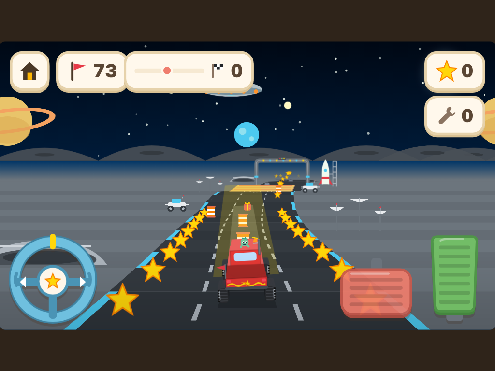 |

| Worlds | |
|---|---|
| 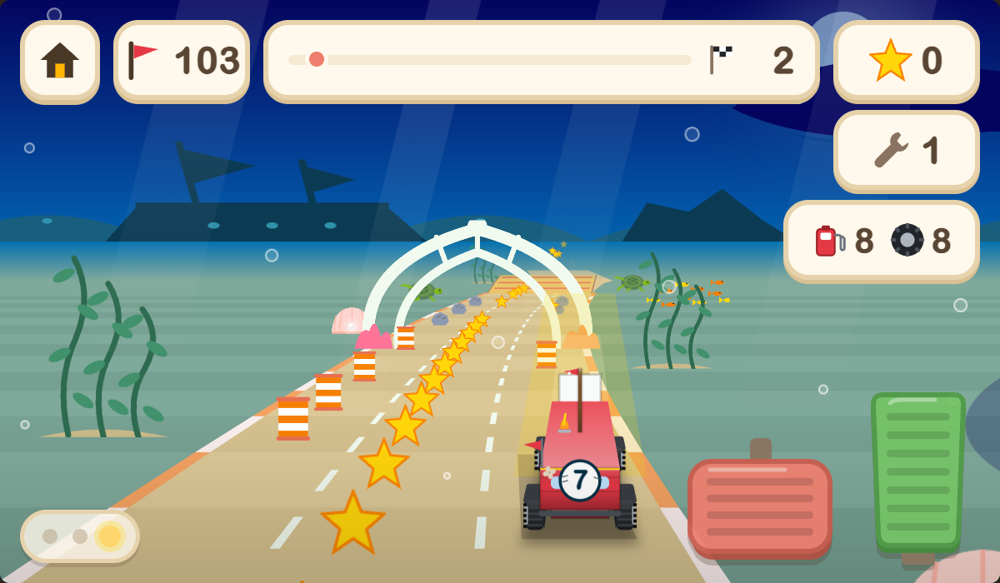 | 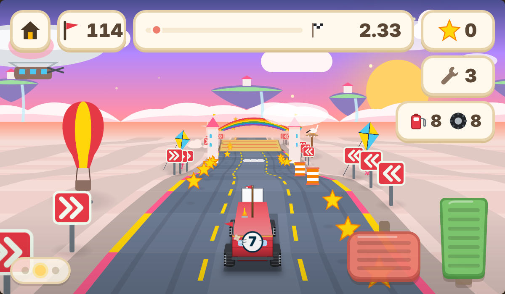 |
| 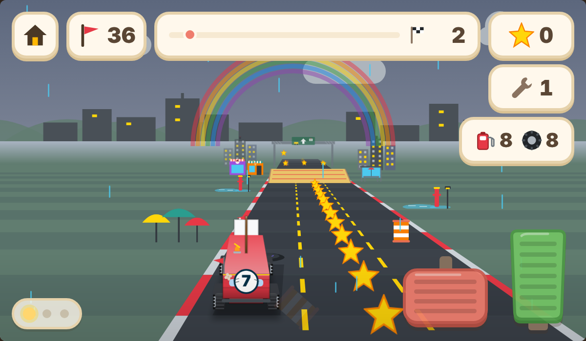 | 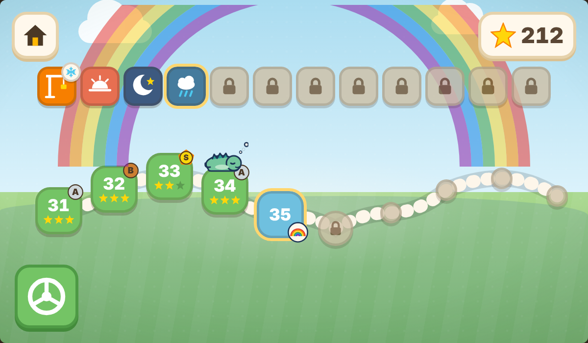 |

| Wild roads | |
|---|---|
| 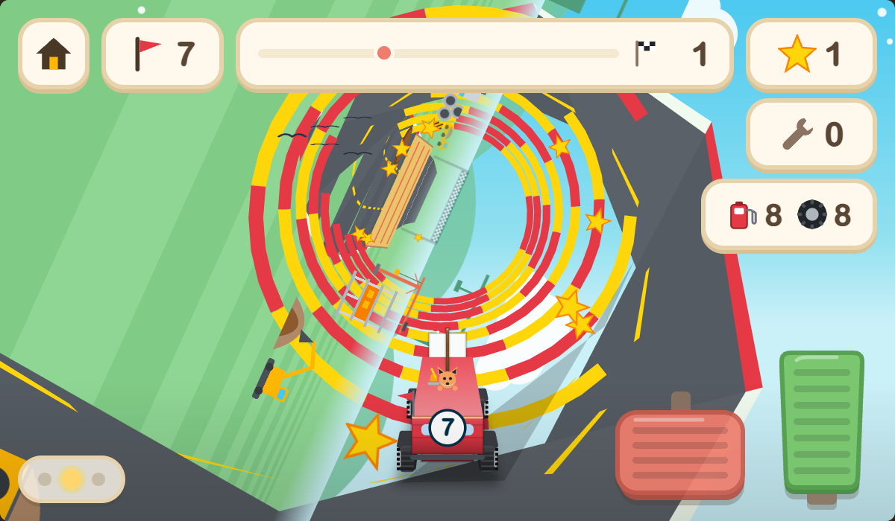 | 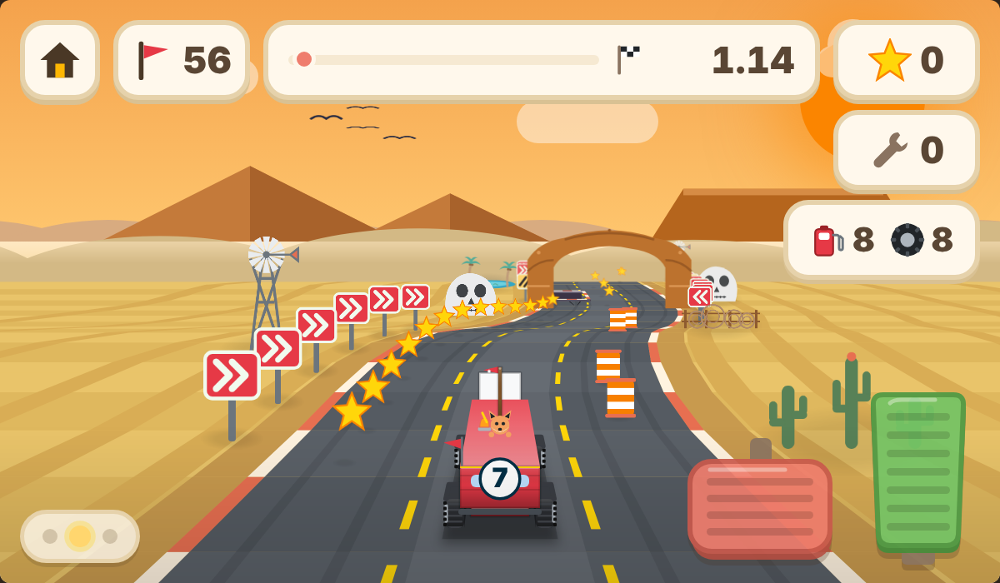 |
| 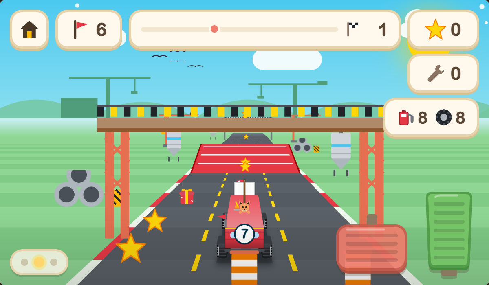 | |

| Album | Results |
|---|---|
| 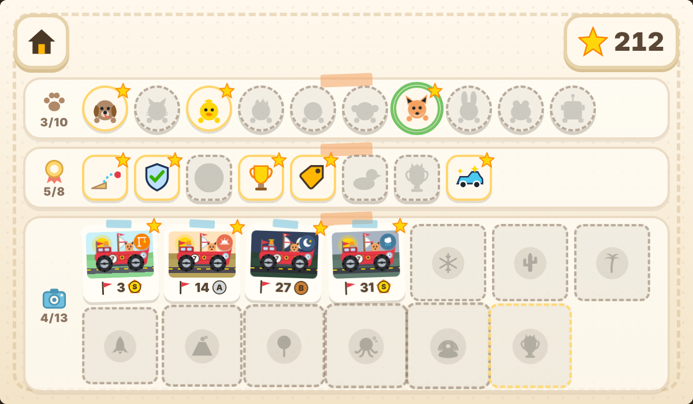 | 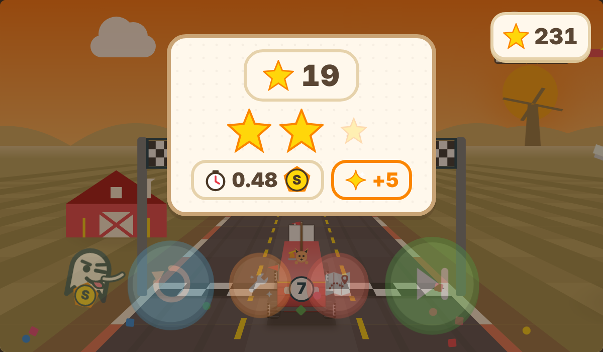 |

## How to play

**The garage.** The game opens on a title screen with your car idling; the big GO lands here. Six category tabs (body, wheels, paint, stickers, extras, workbench) open one
scrollable strip of big picture tiles; tap a tile to equip it, swipe or use the arrows to see more. Locked parts show in full colour with a star price tag: collect stars, tap, own it. The sticker tab also holds a race number: tap the roundel tile, type up to two digits on a big keypad, and 400 stars paints it on both sides of the car (taking it off is free). The workbench tab holds the engine, shield, star magnet, fuel tank and springs upgrades and the upkeep: fix crash damage with the wrench, wash off real mud with your finger, fill the tank, fit new tires. Fuel burns and tires wear as you drive; a dry tank crawls and bald tires slide, but nothing ever stops you. Cross the line spotless and ding-free and your stars pay a shine bonus. The shuffle button at the end of the tab row builds you a surprise from the parts you own. Tap the car to honk, tap the hood to pop it open, tap a wheel to spin it. Once a day a gift capsule waits on the right wall.

**The road.** Hold the gas, steer into stars and away from barrels, rocks, TNT, tumbleweeds and crabs. Your best run rides along as a ghost; the chip under the level flag shows the gap. Ramps jump, puddles splash, capsules pop open with prizes (and sometimes a buddy). The finish gantry brings confetti, a star tally, a 1 to 3 star rating and an S/A/B/C time medal.

**The map.** A winding road of level nodes, with the day's three surprises marked on it. Beat a world's last level to unlock the next and bank a trophy bonus. The free-drive wheel tours every world with no finish line and no timer. Beat all 120 levels and the Victory Parade appears: a rainbow road finale with fireworks and every buddy you have found cheering from the roadside.

**The album.** Buddies you have found (tap one to ride along), "first!" sticker badges, and a polaroid of every finish taken where it happened. Tap a photo or a sticker to see it big.

| | Touch (the real way) | Keyboard (desktop) |
|---|---|---|
| Drive | hold the green gas pedal, or anywhere on the road | W, up arrow, or space |
| Brake | red brake pedal | S or down arrow |
| Steer | swipe left or right anywhere on the road (70 px per lane); the lane dots bottom-left show where you are | A/D or left/right arrows |
| Honk | tap your car | |

## For grown-ups

- **Profiles.** The avatar button (top left of the garage) holds up to three kids, each with their own save. No typing, just faces.
- **Save codes and QR.** The same panel shows a scan-to-open QR: point another device's camera at it and the game opens with the save ready to import (a wordless tick/cross asks first). The copy and paste buttons carry a full save code as text, and opening `https://zacker3310.github.io/vroom/#save=<code>` imports one directly.
- **Quiet mode.** The speaker toggle in the profile panel drops every sound to car-friendly volume. It sticks.
- **Offline and home screen.** From Safari, Share, then Add to Home Screen. It installs with its own icon, launches full-screen in landscape and runs with no connection.
- **Updates.** When a new version is live, a green refresh badge appears beside the avatar in the garage. Press and hold it until the ring fills (about a second and a half, so stray toddler taps do nothing) and the game reloads into the new version. Progress is kept. The version number sits in the corner of the profile panel.
- **Where progress lives.** In the browser's local storage on the device. Clearing Safari website data erases it, so export a save code first if it matters.

## Design principles

These are the rules the game was built on and the test suite enforces. They are not up for debate in a pull request.

1. **Zero required reading.** Icons, pictures and numerals only. No words in the game.
2. **Nothing to lose.** No fail states, no game-overs, no timers that punish. Stars only go up; obstacles bonk-and-stop but never end a run.
3. **Every tap answers instantly** with motion and a synthesized sound.
4. **Every touch target is at least 64 px** rendered on an iPad in landscape (1024x768). Portrait politely asks you to rotate.
5. **One warm design language** everywhere ("Toybox"): cream paper, wood, warm putty for locked states, one amber for selection, one green for go, flat unblurred shadows, staggered pop-in entrances.
6. **Fair for a toddler.** A kid who sits in the middle lane with the gas floored must always reach the finish and still find stars.

## Architecture

Everything is in `index.html`: a `<style>` block, the markup for six scenes (title, garage, map, road, album, celebrate) and one `<script>`. The deeper tour is in [docs/ARCHITECTURE.md](docs/ARCHITECTURE.md); the short version:

- **Stage.** A fixed 1200x700 stage scaled to fit the viewport. Vehicles are SVG part groups recoloured through the `--paint` CSS variable; the same build renders in a side view (garage, album) and a projected rear view (road).
- **Chase-cam projector.** World coordinates keep the side-scroller's `x` (distance along the road) so the level, physics and collision code never changed; the renderer adds a lateral offset and a height and projects through one camera (`HORIZON`, `CAM_D`, `CAM_H`). Curves are eased curvature stretches integrated into a per-frame lateral offset table; hills are cosine bumps the camera rides, so a crest lifts the far road into the sky. Rear-view cars are chunky 3D toy blocks (boxes, cylinders, hulls) painter-sorted and projected through the same camera.
- **Beat sequencer.** A level is a seeded sequence of formations: a signature beat (never one of the last four levels' signatures), one or two contrasts and breathers in one of three rhythms, ramps dropped in on cue, then guarantee passes that enforce ingredients, hard-obstacle and star budgets, clean ramp run-ups and landings, and "a stray barrel never sits inside a star trail".
- **World packs.** Worlds 9 to 12 register themselves at anchor comments by assigning into the live tables (`WORLD_META`, `ROAD_PAL`, scenery pools, hazards, `WORLD_ROAD`, beats, jingles, ambience, star scales, sky events). Shop and paint packs do the same for the catalog.
- **Save codes.** Format v3 is a count-prefixed bit-packed save (95 bytes with today's catalog; the tail carries fuel, tires, the race number and the newer upgrade pips, and older codes simply stop short) rendered as a real QR by a hand-rolled encoder (byte mode, ECC L, versions 1 to 10 with multi-block Reed-Solomon interleaving), verified byte-exact against jsQR. v1 and v2 codes still decode.
- **Audio.** Every sound is synthesized: oscillators and filtered noise through one master compressor. The engine is two detuned saws through a speed-swept low-pass plus a wind layer; each world has a jingle, an ambience bed and its own star-chime scale.
- **Update gate.** The page fingerprints its own `<style>` and `<script>` text at boot (FNV-1a) and re-fetches itself with `cache: "no-store"` on boot, on return to foreground and every ten minutes. A difference shows the badge; a 1.6 s hold saves and reloads through a cache-busting URL.

## Development

```bash
git clone https://github.com/zacker3310/vroom.git
cd vroom
python3 -m http.server 4173     # then open http://localhost:4173/
```

There is no build. Edit `index.html`, reload.

The test suite is 23 Playwright suites (393 checks) that drive the real game in headless Chromium: economy, physics, worlds, album, profiles, save codes, the wash, fuel and tires, the race number, the title screen and daily gift, the ghost race, garage life, the map surprises, the update gate, and the fairness bots that drive all 120 levels.

```bash
npm ci                                   # playwright-core + jsqr, test-only
npx playwright-core install chromium     # or: export CHROMIUM=/path/to/chrome
npm test                                 # serves index.html on a free port, runs everything, prints a table
```

`npm test` runs `tests/run-all.cjs`; `--verbose` streams each suite, `--only verify,shop-check` runs a subset, and `VROOM_URL` points it at a server you already have running. CI runs the same command on every push and pull request to `main`. See [tests/README.md](tests/README.md) for what each suite covers and [CONTRIBUTING.md](CONTRIBUTING.md) for how to add a world, body or paint.

## Project history

The game grew through twelve user-directed versions and their point releases, from a five-body garage to twelve worlds, ghosts, daily surprises and a workbench with five ladders. [TASKS.md](TASKS.md) is the version-by-version log; [SPEC.md](SPEC.md) is the living design spec. It was built with Claude Code in an agentic build loop: design and content generated by parallel subagents, every round audited by an adversarial reviewer with fix authority before merge. The audit trail is in `.buildloop/`.

## Credits

Designed and directed by Zac Acker for one particular kid. Built with Claude. All art and sound are original and generated in code; the only third-party code anywhere in the project is the test tooling (`playwright-core`, `jsqr`), and none of it ships.

If it keeps your kid busy on a road trip too, it did its job.

## License

MIT, see [LICENSE](LICENSE). Copyright (c) 2026 zacker3310.
